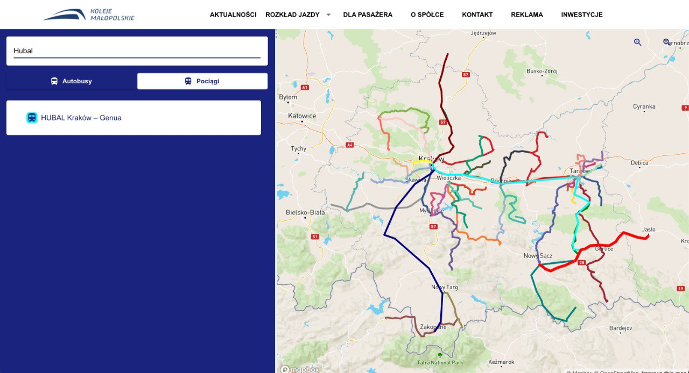
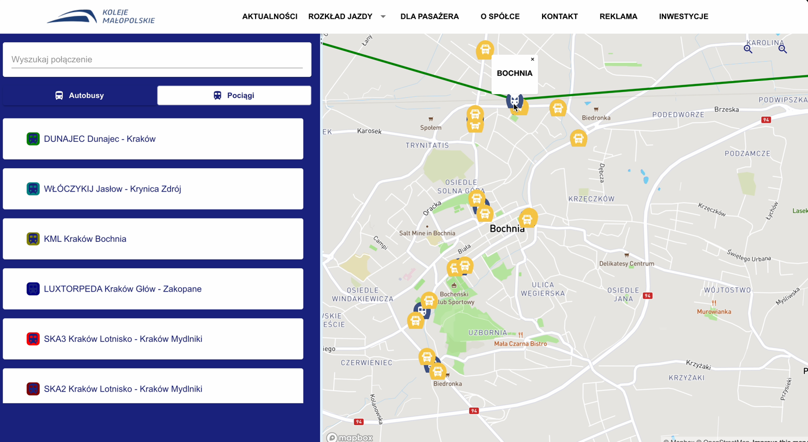

Kościuszkon hackathon frontend
=======================

If you have attended any hackathons in the past, then you know how much time it takes to get a project started: decide on what to build, pick a programming language, pick a web framework, pick a CSS framework. A while later, you might have an initial project up on GitHub, and only then can other team members start contributing. Or how about doing something as simple as *Sign in with Facebook* authentication? You can spend hours on it if you are not familiar with how OAuth 2.0 works.

When I started this project, my primary focus was on **simplicity** and **ease of use**.
I also tried to make it as **generic** and **reusable** as possible to cover most use cases of hackathon web apps, without being too specific. In the worst case, you can use this as a learning guide for your projects, if for example you are only interested in **Sign in with Google** authentication and nothing else.

### Testimonials

> [**“Nice! That README alone is already gold!”**](https://www.producthunt.com/tech/hackathon-starter#comment-224732) 
> — Adrian Le Bas

> [**“Awesome. Simply awesome.”**](https://www.producthunt.com/tech/hackathon-starter#comment-224966) 
> — Steven Rueter

> [**“I'm using it for a year now and many projects, it's an awesome boilerplate and the project is well maintained!”**](https://www.producthunt.com/tech/hackathon-starter#comment-228610) 
> — Kevin Granger

> **“Small world with Sahat's project. We were using his hackathon starter for our hackathon this past weekend and got some prizes. Really handy repo!”** 
> — Interview candidate for one of the companies I used to work with.

<h4 align="center">Modern Theme</h4>

<h4 align="center">Adjusted to already existing features due to integration simpilicty </h4>

Features
--------
Our mail goal was to provide as detailed and accessible application as we can, that is why 
we focused on real life scenarios.

- **Map**
    - Conditionally rendering pins, based on zoom range
    - Interactive pins with popups
    - Drawing lines between pins
    - Flexible management selected pins
    - Adjusted pins for means of transport as well as trips
    - Possibility to create one big interactive map of all trips and stops in Malopolska 
  
Prerequisites
-------------

- Backend (Preferably our backend written in Nest.JS)
- [Node.js 18+](http://nodejs.org)
- Command Line Tools
- &nbsp;**Mac OS X:** [Xcode](https://itunes.apple.com/us/app/xcode/id497799835?mt=12) (or **OS X 10.9+**: `xcode-select --install`)
- &nbsp;**Windows:** [Visual Studio Code](https://code.visualstudio.com) + [Windows Subsystem for Linux - Ubuntu](https://docs.microsoft.com/en-us/windows/wsl/install-win10) OR [Visual Studio](https://www.visualstudio.com/products/visual-studio-community-vs)
- &nbsp;**Ubuntu** / &nbsp;**Linux Mint:** `sudo apt-get install build-essential`
- &nbsp;**Fedora**: `sudo dnf groupinstall "Development Tools"`
- &nbsp;**OpenSUSE:** `sudo zypper install --type pattern devel_basis`
- MapBox account and API key

Getting Started
---------------

**Step 1:** The easiest way to get started is to clone the repository:

**Note:** I highly recommend installing [Nodemon](https://github.com/remy/nodemon). It watches for any changes in your  node.js app and automatically restarts the server. Once installed, instead of `node app.js` use `nodemon app.js`. It will
save you a lot of time in the long run, because you won't need to manually restart the server each time you make a small change in code. To install, run `sudo npm install -g nodemon`.

**Step 2:** Obtain API Keys and change configs if needed
After completing step 1 and configuring MapBox, you should be able to access the application through a web browser and use local user accounts. However, certain functions like API integrations may not function correctly until you obtain specific keys from service providers. The keys provided in the project serve as placeholders, and you can retain them for features you are not currently utilizing. To incorporate the acquired keys into the application, you have two options:

1.  Set environment variables in your console session: Alternatively, you can set the keys as environment variables directly through the command prompt. For instance, in bash, you can use the `export` command like this: `export VAR=xxxxxx`. This method is considered a better practice as it reduces the risk of accidentally including your secrets in a code repository.
2. Replace the keys in the `.env.example` file: Open the `.env.example` file and update the placeholder keys with the newly acquired ones. This method has the risk of accidental checking-in of your secrets to code repos.

*What to get and configure:*

- ngrok and HTTPS
  If you want to use some API that needs HTTPS to work (for example Pinterest or Facebook),
  you will need to download [ngrok](https://ngrok.com/). Start ngrok, set your BASE_URL to the forwarding address  (i.e  `https://3ccb-1234-abcd.ngrok-free.app` ), and use the forwarding address to access your application.  If you are using a proxy like ngrok, you may get a CSRF mismatch error if you try to access the app at `http://localhost:8080` instead of the https://...ngrok-free.app address.

  After installing or downloading the standalone ngrok client you can start ngrok to intercept the data exchanged on port 8080 with `./ngrok http 8080` in Linux or `ngrok http 8080` in Windows.

- MapBox
    Obtain a MapBox API key by signing up at [MapBox](https://www.mapbox.com/). You can use the default public token provided in the project, but it is recommended to get your own. Replace the default public token with your own in the `.env` file. 

**Step 3:** Develop your application and customize the experience

**Step 4:** Optional - deploy to production
See:
- [Deployment](#deployment)

# Obtaining API Keys
You will need to obtain appropriate credentials (Client ID, Client Secret, API Key, or Username & Password) for API and service provides which you need.  See Step 2 in the Getting started section for more info.

Changelog
---------

You can find the changelog for the project in: [CHANGELOG.md](https://github.com/sahat/hackathon-starter/blob/master/CHANGELOG.md)

Business Logic
--------------
Our program is aimed to specific group which should resolve problems met in a given industry. More information about parsing 
travelling formats and standardization can be found in the main documentation.

Live Demo
--------------
Below You can find live demos for our project from frontend site:

https://youtu.be/TYUbS8otYP4
https://youtu.be/9DXJ4uNtRkE

Technologies
--------------
This page was simply created with the help of react, MapBox, Material UI, as well as axios, and some helpers.

Contributing
------------

If something is unclear, confusing, or needs to be refactored, please let me know.
Pull requests are always welcome, but due to the opinionated nature of this project, I cannot accept every pull request. Please open an issue before submitting a pull request.

License
-------
